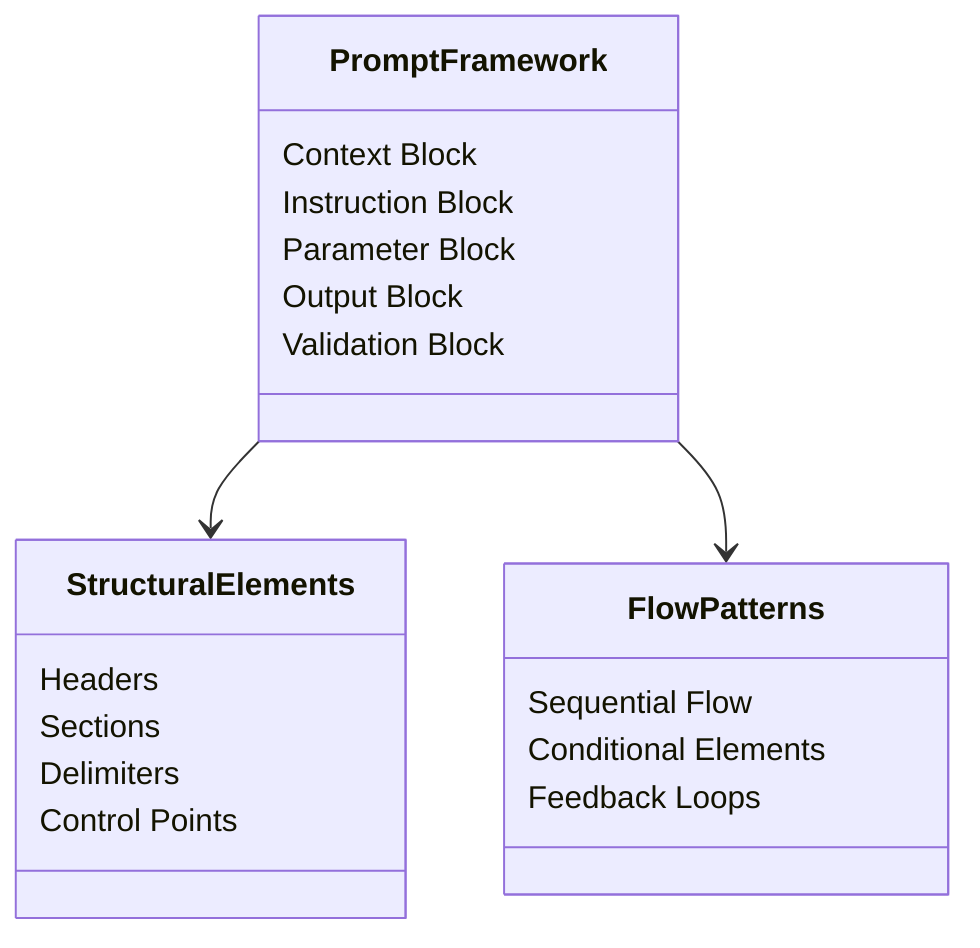

<!-- A Prompt Skeleton Analysis Toolkit.md

This toolkit can be used to breakdown the structure of a prompt. This is best used on large complex prompts that do scary things you want to learn.

This is still very experimental. Feedback is welcome.

/dp

-->

<!-- - - - - - - - - - BEGIN STEP 0 - new GAI session starter prompt - - - - - - - - - -->

Hi AI Assistant (Claude, ChatGPT, Copilot, Gemini). I want you to think like an expert prompt engineer to help me analyze prompt structures. I'd like to establish foundational definitions for analyzing prompt structures. These should focus on universal patterns rather than specific implementations. My end goal here is to both understand how the prompts work, and teach others the same using your analysis.

**IMPORTANT** you are to focus on basic structural patterns rather than specific prompt implementations. We're looking at the "skeleton" itself rather than the "organs" it might contain.

## Definitions & Examples

### 1. Universal Prompt Skeleton
A prompt skeleton represents the fundamental structural framework that can be applied to any prompt type. It defines the basic organizational elements while remaining content-agnostic.

Example - Converting Specific to Universal:

Original (Too Specific):
```markdown
Hello [AI], act as a [role] and provide a [content type] for [specific subject].
```

Universal Skeleton:
```markdown
## Context:
[AI identification and role setting]

## Instructions:
[Core directives and requirements]

## Parameters:
[Variable elements and constraints]

## Output Format:
[Delivery structure specification]

## Validation:
[Quality check and refinement requests]
```

### 2. Structural Anatomical Breakdown
A hierarchical analysis of the universal components that make up any prompt skeleton, showing how structural elements relate regardless of content. This is usually best done by providing mermaid notation for a classDiagram, sequenceDiagram, and a 'graph TD' to represent the Universal Structure. Note that pre-conditions should be identified as such, and connected to the other parts of the diagram via a dotted line.

Example Universal Structure:


### 3. Universal Pattern Annotation
A metadata layer that identifies the functional purpose of each structural element, independent of specific content.

Example Universal Annotation:
```markdown
## [Section Header]                 # BLOCK: Primary structural division
[Context Element]                   # CONTEXT: Sets operational framework
[Instruction Element]               # FLOW: Defines process sequence
[Parameter Element]                 # INPUT: Marks variable injection points
[Output Element]                    # DELIVERY: Specifies return format
[Validation Element]                # VERIFY: Ensures structural completeness
```

Do you understand how these structural definitions focus on universal patterns rather than specific implementations?

Give me 3 short, crisp bullet points, each of 10 words or less, that  explain to me what your job is. 3 more that explains what you must NOT do.


<!-- - - - - - - - - - END STEP 0 - new GAI session starter prompt - - - - - - - - - -->


<!-- - - - - - - - - - BEGIN STEP 1 - request Universal Skeleton Analysis - - - - - - - - - -->
{CONTEXT}

<!-- put in the prompt here, use backticks and markdown if possible -->

{QUESTION}

First, answer these questions for Universal Skeleton Analysis:

1. "What are the major structural blocks in this prompt?"
2. "How does information flow between these blocks?"
3. "What are the essential control points?"
4. "Where are the variable injection points?"
5. "What structural patterns ensure proper execution?"

Then ask me: "Should I go ahead and generate the Universal Skeleton Analysis or should I consider some corrections on my answers first?"

<!-- - - - - - - - - - END STEP 1 - request Universal Skeleton Analysis - - - - - - - - - -->


<!-- - - - - - - - - - BEGIN STEP 2 - request Structural Anatomical Breakdown - - - - - - - - - -->


Second, answer these questions for Structural Breakdown:

1. "What are the fundamental building blocks of this prompt structure?"
2. "How do these blocks relate to each other?"
3. "What are the critical control flow patterns?"
4. "Where are the key structural dependencies?"
5. "What universal elements ensure proper execution?"

Then ask me: "Should I go ahead and generate the Structural Anatomical Breakdown or should I consider some corrections on my answers first?"

If I respond with "Yes," then give me a short list of Mermaid diagram script options, and what each would provide me. Ask me if I'd like to render any of the diagram options."

<!-- - - - - - - - - - END STEP 2 - request Structural Anatomical Breakdown - - - - - - - - - -->


<!-- - - - - - - - - - BEGIN STEP 3- request Universal Pattern Annotation - - - - - - - - - -->


Third, answer these questions for Pattern Annotation:

1. "What is the functional purpose of each structural block?"
2. "How do different structural elements interact?"
3. "Where are the critical control points in the structure?"
4. "What structural metadata needs to be preserved?"
5. "How do we maintain structural integrity across implementations?"

Then ask me: "Should I go ahead and generate the Universal Pattern Annotation or should I consider some corrections on my answers first?"

<!-- - - - - - - - - - END STEP 3 - request Universal Pattern Annotation - - - - - - - - - -->

