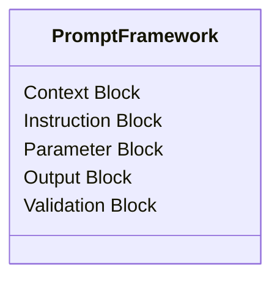

# Prompt Architecture Analysis Tools

**Learn how prompts work by reverse engineering their structure**

This is the advanced lab where you learn to see the skeleton beneath the skin of effective prompts. Through structural analysis and reverse engineering, you'll understand the universal patterns that make AI conversations strategically powerful.

---

## Why Prompt Architecture Matters

### Beyond Copy-Paste Usage
Most people use prompts like black boxes - they work, but you don't understand why. Understanding prompt architecture enables:
- **Intelligent customization** - Adapt prompts for your specific context without breaking them
- **Quality diagnosis** - Know why a prompt fails and how to fix it
- **Advanced building** - Create sophisticated prompts using proven structural patterns
- **Teaching others** - Help teammates understand AI collaboration principles

### From User to Architect
Understanding structure transforms you from prompt user to prompt architect:
- **Pattern recognition** - See the universal elements across effective prompts
- **Principled adaptation** - Modify with confidence rather than trial-and-error
- **Framework thinking** - Apply structural knowledge to new domains
- **Meta-learning** - Understand how to learn prompt engineering itself

---

## 🏗️ Structural Analysis Framework

### **The Universal Prompt Skeleton**
Every effective PM prompt contains these structural elements:

```markdown
## Context Block
[AI role setting and expertise framing]

## Instruction Block  
[Core directives and behavioral requirements]

## Parameter Block
[Variable elements and user-specific constraints]

## Output Block
[Delivery format and quality specifications]

## Validation Block
[Quality checks and refinement mechanisms]
```

### **Flow Pattern Analysis**
Understanding how information moves through prompt structures:
- **Sequential flow** - Step-by-step progression through logical stages
- **Conditional elements** - Branching logic based on user context
- **Feedback loops** - Iterative refinement and validation cycles
- **Control points** - Places where user input shapes AI behavior

---

## 🧪 Analysis Tools & Methods

### **Current Analysis Toolkit**

| Tool | Purpose | Learning Focus |
|------|---------|----------------|
| **[A Prompt Skeleton Analysis Toolkit.md](A%20Prompt%20Skeleton%20Analysis%20Toolkit.md)** | Systematic structural breakdown | Universal prompt patterns |
| **[prompt generator prompt](prompt%20generator%20prompt)** | Meta-analysis template | Pattern abstraction methodology |

### **Structural Analysis Process**
The toolkit guides you through **three analysis levels**:

1. **Universal Skeleton Analysis**
   - Identify major structural blocks
   - Map information flow between sections
   - Locate control points and variable injection

2. **Anatomical Breakdown**
   - Create hierarchical analysis of components
   - Generate Mermaid diagrams showing relationships
   - Understand critical dependencies

3. **Universal Pattern Annotation**
   - Document functional purpose of each element
   - Create metadata layer for structural understanding
   - Preserve teaching methodology across implementations

---

## 📊 Diagram-Based Understanding

### **Visual Analysis Methods**
The toolkit generates multiple diagram types for comprehensive understanding:

**Class Diagrams** - Show structural relationships


**Sequence Diagrams** - Map interaction flows
- User input → AI processing → Output generation → Validation loops

**Graph Diagrams** - Illustrate dependency structures  
- How different prompt elements connect and depend on each other

---

## 🎯 Learning Applications

### **Reverse Engineering Workflow**
1. **Select target prompt** - Choose a complex, effective prompt to analyze
2. **Apply analysis framework** - Use the structural toolkit systematically
3. **Generate visual maps** - Create diagrams showing prompt architecture
4. **Extract patterns** - Identify reusable structural principles
5. **Test understanding** - Build new prompts using discovered patterns

### **Pattern Library Development**
Build your own collection of structural patterns:
- **Conversational scaffolding patterns** - Question progression architectures
- **Context building patterns** - How prompts gather and use information
- **Framework integration patterns** - Weaving PM methodologies into AI conversations
- **Quality control patterns** - Built-in validation and refinement mechanisms

### **Diagnostic Applications**
When prompts don't work as expected:
- **Structural diagnosis** - Which architectural elements are missing?
- **Flow analysis** - Where does the conversation breakdown occur?
- **Context evaluation** - Is sufficient information being gathered?
- **Output assessment** - Are quality controls adequate?

---

## 🧠 Advanced Structural Concepts

### **Meta-Architecture Principles**
Understanding how prompts **teach while they execute**:

**Comment-Driven Pedagogy**
```markdown
<!-- 
This section teaches you WHY this structure works
while being invisible to AI execution
-->
```

**Self-Documenting Structures**
- Prompts that explain their own architecture through comments
- Built-in learning materials for users and AI
- Reflective methodology that makes thinking visible

**Progressive Disclosure Patterns**  
- Information revealed in logical sequence
- Complexity built gradually through guided steps
- Context accumulated systematically over conversation

### **Structural Quality Indicators**
Signs of well-architected prompts:
- **Clear separation of concerns** - Each section has distinct purpose
- **Logical information flow** - Natural progression from context to output
- **Robust error handling** - Fallback questions for missing information
- **Teaching integration** - Structure itself educates users
- **Adaptation flexibility** - Easy customization without breaking

---

## 🔧 Practical Implementation

### **For PM Tool Building**
Use structural analysis to:
- **Understand proven patterns** before building new prompts
- **Diagnose prompt failures** when customizations don't work
- **Extract reusable components** from successful prompts
- **Design teaching-integrated structures** for team adoption

### **For Team Training**
Apply architectural understanding to:
- **Teach prompt engineering principles** rather than just examples
- **Help teams customize tools** confidently for their context
- **Build internal expertise** in AI collaboration
- **Create quality standards** for prompt development

### **For Advanced Building**
Leverage structural knowledge for:
- **Meta-prompt development** - Tools that generate other tools
- **Complex workflow design** - Multi-stage AI collaboration processes  
- **Integration architecture** - Connecting prompts across workflows
- **Novel pattern development** - Advancing the field through innovation

---

## 🎓 Skill Development Progression

### **Level 1: Structure Recognition**
**Goal:** See the architectural patterns in existing prompts

**Activities:**
- Analyze 5+ complex prompts using the toolkit
- Identify common structural elements across different domains
- Create visual maps of prompt architectures
- Practice describing prompt structures in universal terms

**Milestone:** Can explain why a prompt works in structural terms

### **Level 2: Pattern Abstraction**
**Goal:** Extract reusable principles from specific implementations

**Activities:**
- Compare prompt structures across different PM functions
- Identify universal patterns vs. domain-specific adaptations  
- Build personal library of structural components
- Create template architectures for common PM needs

**Milestone:** Can adapt prompt structures to new contexts successfully

### **Level 3: Architecture Innovation**
**Goal:** Develop novel structural approaches and teach others

**Activities:**
- Design new architectural patterns for unexplored PM challenges
- Create meta-analysis tools that improve the analysis process itself
- Contribute structural insights to the broader PM community
- Mentor others in architectural thinking

**Milestone:** Others successfully use architectural patterns you've developed

---

## 🛠️ Using the Analysis Toolkit

### **Step-by-Step Analysis Process**

**Step 0: Session Setup**
- Establish foundational definitions for structural analysis
- Set focus on universal patterns rather than specific content
- Prepare AI assistant for architectural thinking mode

**Step 1: Universal Skeleton Analysis**  
- Identify major structural blocks in target prompt
- Map information flow between blocks
- Locate essential control points and variable injection

**Step 2: Anatomical Breakdown**
- Generate Mermaid diagrams showing structural relationships
- Choose appropriate diagram type (class, sequence, graph)
- Document hierarchical component organization

**Step 3: Pattern Annotation**
- Create metadata layer describing functional purpose
- Document how elements interact and depend on each other
- Preserve structural integrity principles for reuse

### **Quality Assessment Framework**
Rate analyzed prompts on structural characteristics:
- **Clarity** - Are architectural boundaries clear?
- **Completeness** - Does structure handle all necessary elements?
- **Flexibility** - Can structure adapt to different contexts?
- **Teaching** - Does architecture itself educate users?
- **Maintainability** - Is structure easy to modify and extend?

---

## 🤝 Contributing Structural Insights

### **What We're Looking For**
- **Novel architectural patterns** you've discovered through analysis
- **Comparative studies** showing how structures work across domains
- **Failure analysis** - Why certain structural approaches don't work
- **Teaching innovations** - Better ways to help others understand architecture

### **Analysis Contribution Standards**
1. **Use universal terminology** - Focus on transferable patterns
2. **Include visual documentation** - Diagrams make structures clear
3. **Test across multiple examples** - Validate patterns beyond single cases
4. **Explain teaching methodology** - How does this help others learn?

### **Research Areas Needing Analysis**
- **Cross-platform compatibility** - How structures work across AI systems
- **Scalability patterns** - Architectures that work for complex, multi-stage processes
- **Integration frameworks** - Connecting prompts into larger workflows
- **Quality measurement** - Metrics for evaluating structural effectiveness

---

## 💡 The Meta-Learning Goal

### **Learning How to Learn Prompt Engineering**
Understanding structure teaches you **how to teach yourself**:
- **Pattern recognition skills** transfer to new domains
- **Structural thinking** enables principled experimentation
- **Quality assessment** helps you evaluate your own work
- **Teaching ability** allows you to help others develop expertise

### **Building PM Community Expertise**
Structural analysis serves the anthropological evolution goal:
- **Shared vocabulary** for discussing prompt quality and design
- **Teaching resources** that transfer knowledge effectively  
- **Quality standards** that improve community-wide prompt development
- **Innovation acceleration** through principled architectural experimentation

---

## 🔮 Future Directions

### **Emerging Research Areas**
- **AI-specific architectural patterns** - Structures that leverage unique AI capabilities
- **Dynamic prompt architectures** - Self-modifying structures based on context
- **Cross-modal integration** - Architectures combining text, visual, and data elements
- **Collaborative prompt systems** - Structures supporting human-AI team workflows

### **Tool Development Opportunities**
- **Automated structural analysis** - AI tools that analyze prompt architecture
- **Pattern matching systems** - Find similar structures across large prompt libraries
- **Architecture validation** - Tools that verify structural integrity
- **Teaching integration** - Systems that generate educational content from structure analysis

---

## ⚠️ Advanced Usage Notes

### **When to Focus on Structure vs. Content**
**Focus on structure when:**
- Learning prompt engineering principles
- Troubleshooting prompt failures
- Building reusable tools and templates
- Teaching others AI collaboration skills

**Focus on content when:**
- Solving specific, immediate PM problems
- Customizing existing tools for your context
- Rapid prototyping and experimentation
- Time-sensitive project work

### **Balancing Analysis with Application**
- **Don't over-engineer** - Sometimes simple prompts are most effective
- **Start with proven patterns** - Build on successful architectures
- **Test structural changes** - Validate modifications across multiple uses
- **Maintain teaching focus** - Ensure architecture serves learning goals

---

## 🏆 Mastery Indicator

**You've mastered prompt architecture when you can look at any effective prompt and immediately see:**
- The universal structural patterns it employs
- Why those patterns work for its specific purpose  
- How to adapt the structure for different contexts
- What's missing that could make it more effective
- How to teach others to build similar architectures

**This is the foundation for becoming a prompt architect rather than just a prompt user.**

---

*Ready to see the matrix? Start with the analysis toolkit and dissect a complex prompt that you find particularly effective.*