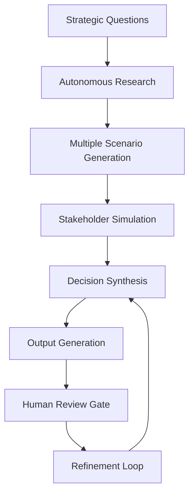

# Experimental AI Workflows and Vibe Coding

**Cutting-edge approaches to AI-assisted product development**

This is the laboratory for next-generation product management techniques. Here we explore autonomous AI agents, advanced synthesis methods, and experimental workflows that push the boundaries of human-AI collaboration in product development.

---

## The Future of AI-Assisted Product Management

### Beyond Simple Prompting
While most AI usage in product management focuses on single-prompt interactions, the future lies in:
- **Autonomous AI workflows** - AI agents that execute complete product development cycles
- **Multi-agent collaboration** - Different AI agents specializing in research, analysis, synthesis
- **Contextual continuity** - AI that maintains project memory across long development cycles
- **Simulation-driven development** - Testing product concepts through AI-generated scenarios

### Experimental Philosophy
This collection represents bleeding-edge explorations in:
- **Vibe-coding approaches** - Rapid prototyping of product concepts through AI collaboration
- **Agentic workflows** - AI agents that operate with increasing autonomy
- **Advanced reasoning models** - Leveraging latest AI capabilities for strategic thinking
- **Cross-platform orchestration** - Coordinating AI tools across different environments

---

## 🧪 Current Experiments

### **Autonomous Product Development**

| Experiment | Innovation | Status |
|------------|------------|--------|
| **[vibe.prd-generated-via-search-and-agentic-simulation.md](vibe.prd-generated-via-search-and-agentic-simulation.md)** | Full PRD generation through autonomous research & synthesis | Active exploration |

### **Key Features of the Autonomous PRD Generator:**
- **Guided discovery** through 4 strategic questions
- **Autonomous research sweep** with credible source citation
- **Multiple simulation scenarios** with decision rationale logging
- **Stakeholder perspective simulation** across all review gates
- **Complete PRD generation** from problem to implementation plan

---

## 🎯 Experimental Methodologies

### **Vibe-Coding for Product Concepts**
**Definition:** Rapid iterative development of product ideas through conversational AI collaboration

**Key Principles:**
- **Speed over perfection** - Rapid concept validation and iteration
- **Conversational development** - Natural language as primary interface
- **Context preservation** - Maintaining project memory across sessions
- **Multi-modal thinking** - Text, visual, and structured data integration

### **Agentic Product Management**
**Definition:** AI agents operating with increasing autonomy in product development tasks

**Capability Levels:**
1. **Guided execution** - AI follows detailed human instructions
2. **Semi-autonomous** - AI makes tactical decisions within strategic constraints  
3. **Autonomous with oversight** - AI operates independently with human approval gates
4. **Full autonomy** - AI manages complete product development workflows

### **Simulation-Driven Development**
**Definition:** Using AI to simulate multiple scenarios, stakeholders, and outcomes before committing to product decisions

**Applications:**
- **Market scenario modeling** - Testing product concepts across different market conditions
- **Stakeholder reaction simulation** - Predicting responses from engineering, sales, legal, etc.
- **User behavior modeling** - Simulating adoption patterns and usage scenarios
- **Competitive response analysis** - Anticipating competitor reactions and counter-moves

---

## 🔬 Research Areas

### **Advanced AI Reasoning Integration**
Exploring how latest AI capabilities enhance product management:
- **Chain-of-thought reasoning** for complex strategic analysis
- **Multi-step problem decomposition** for feature prioritization  
- **Analogical reasoning** for market opportunity identification
- **Causal inference** for understanding user behavior patterns

### **Cross-Platform AI Orchestration**
Building workflows that leverage multiple AI systems:
- **ChatGPT Teams** in Agent mode with GPT-5 reasoning
- **Gemini Pro Canvas** with 2.5 Pro reasoning capabilities
- **Claude Code integration** with Sonnet 4 for development
- **VS Code extensions** (Cline, Continue) for implementation
- **Cursor and Replit** environments for rapid prototyping

### **Memory and Context Management**
Developing systems for maintaining project continuity:
- **Session memory preservation** across multiple AI interactions
- **Project knowledge graphs** for complex product development
- **Stakeholder context tracking** across long development cycles
- **Decision history logging** for learning and accountability

---

## ⚡ Getting Started with Experimental Workflows

### **Prerequisites**
Before diving into experimental approaches:
- **Solid foundation** in basic prompt engineering
- **Experience** with multiple AI platforms (ChatGPT, Claude, Gemini)
- **Comfort with uncertainty** - These are experimental techniques
- **Willingness to iterate** - Expect failures and learning cycles

### **Beginner Experimental Path**
1. **Try autonomous PRD generation** - Start with [vibe.prd-generated-via-search-and-agentic-simulation.md](vibe.prd-generated-via-search-and-agentic-simulation.md)
2. **Analyze the process** - Notice how AI agents make decisions
3. **Customize parameters** - Adjust simulation scenarios for your context
4. **Compare outcomes** - How does autonomous generation compare to manual processes?

### **Advanced Experimental Techniques**
1. **Multi-agent orchestration** - Coordinate different AI agents for specialized tasks
2. **Custom workflow design** - Build your own autonomous product development processes  
3. **Cross-platform integration** - Combine multiple AI tools for enhanced capabilities
4. **Novel application development** - Push boundaries in unexplored product management domains

---

## 🛠️ Technical Implementation

### **Environment Setup for Vibe-Coding**
Different platforms offer different capabilities:

**ChatGPT Teams + GPT-5 Thinking:**
- Best for complex reasoning and multi-step analysis
- Agent mode enables autonomous task execution
- Thinking model provides transparent reasoning chains

**Gemini Pro Canvas + 2.5 Pro Reasoning:**
- Excellent for collaborative document creation
- Strong reasoning capabilities for strategic analysis
- Canvas mode enables iterative refinement

**Claude Code + Sonnet 4:**
- Superior for code generation and technical implementation
- Strong analytical capabilities for product requirements
- Integrated development environment functionality

### **Workflow Architecture Patterns**

---

## 🧠 Learning from Experimental Results

### **What We're Discovering**
Early experiments reveal:
- **AI excels at synthesis** across large amounts of information
- **Simulation quality depends** on input scenario richness
- **Human oversight remains critical** for strategic decision validation
- **Iterative refinement** dramatically improves output quality
- **Context preservation** enables more sophisticated reasoning chains

### **Emerging Best Practices**
- **Start with rich context** - Better inputs yield exponentially better outputs
- **Design for iteration** - Build refinement loops into experimental workflows
- **Log decision rationale** - Track why AI agents made specific choices
- **Validate through human judgment** - AI provides analysis, humans make final decisions
- **Measure learning velocity** - How quickly can you develop product insights?

### **Common Experimental Pitfalls**
- **Over-relying on AI autonomy** without sufficient human oversight
- **Insufficient context setting** leading to generic outputs
- **Ignoring edge cases** that AI simulation doesn't capture
- **Treating experimental outputs as final decisions** rather than starting points

---

## 🔮 Future Directions

### **Next-Generation Capabilities**
Areas of active exploration:
- **Real-time market data integration** for dynamic product strategy
- **User behavior prediction** through advanced simulation modeling
- **Automated competitive intelligence** gathering and analysis
- **Predictive roadmapping** based on market trend analysis

### **Philosophical Questions**
As AI capabilities advance, we're exploring:
- **What remains uniquely human** in product management?
- **How do we maintain human judgment** while leveraging AI capabilities?
- **What new skills do PMs need** in an AI-augmented world?
- **How do we ensure AI recommendations align** with human values and ethics?

### **Community Research Opportunities**
Areas where PM community input would be valuable:
- **Cross-industry validation** of experimental techniques
- **Ethical frameworks** for AI-assisted product development
- **Measurement methodologies** for human-AI collaboration effectiveness
- **Skill development pathways** for AI-augmented product management

---

## 🤝 Contributing to Experimental Research

### **What We're Looking For**
- **Novel AI workflow experiments** you've developed and tested
- **Cross-platform integration techniques** that enhance PM capabilities
- **Failure analysis** - What experimental approaches didn't work and why?
- **Ethical considerations** - How to maintain human agency in AI-assisted development

### **Research Collaboration Standards**
1. **Document methodology clearly** - Others should be able to reproduce your experiments
2. **Share both successes and failures** - Negative results are valuable learning
3. **Include ethical considerations** - Address potential risks and mitigation strategies
4. **Test across multiple contexts** - Validate beyond your specific use case

### **Contribution Areas**
- **New experimental workflows** for specific PM challenges
- **Integration guides** for emerging AI platforms and tools
- **Measurement frameworks** for evaluating experimental effectiveness
- **Case studies** from real product development experiments

---

## ⚠️ Experimental Warnings & Guidelines

### **Use Experimental Techniques Responsibly**
- **These are experiments** - Not proven methodologies for critical product decisions
- **Maintain human oversight** - AI agents should augment, not replace human judgment
- **Validate outputs thoroughly** - Experimental results require careful verification
- **Consider ethical implications** - How might these techniques affect stakeholders?

### **When to Use vs. Traditional Methods**
**Use experimental approaches when:**
- Exploring new product opportunities with high uncertainty
- Rapid prototyping and concept validation scenarios
- Learning about AI capabilities and limitations
- Research and development phases of product work

**Stick to proven methods when:**
- Making critical product decisions with significant consequences
- Working with sensitive customer data or privacy concerns
- Operating under tight regulatory constraints
- Leading teams who aren't comfortable with experimental uncertainty

---

## 🌟 The Vision: Human-AI Strategic Partnership

**The future of product management isn't about AI replacing humans—it's about creating unprecedented strategic partnerships.**

These experimental workflows explore how to:
- **Amplify human strategic thinking** through AI analytical capabilities
- **Accelerate insight generation** through autonomous research and synthesis
- **Simulate complex scenarios** to test product concepts before implementation
- **Learn continuously** from both successes and failures

**We're not just building better tools—we're exploring what product management becomes when augmented by advanced AI capabilities.**

---

*Ready to experiment with the future? Start with autonomous PRD generation and see how AI agents can accelerate your strategic thinking.*